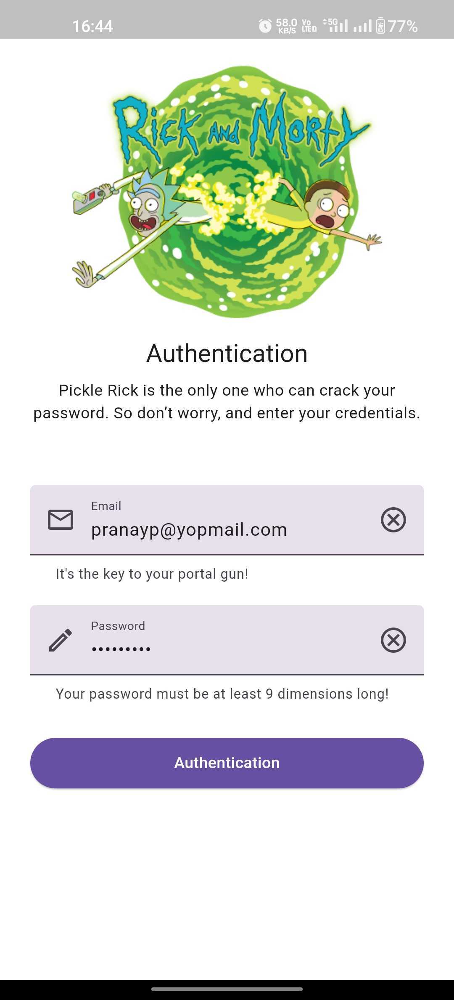
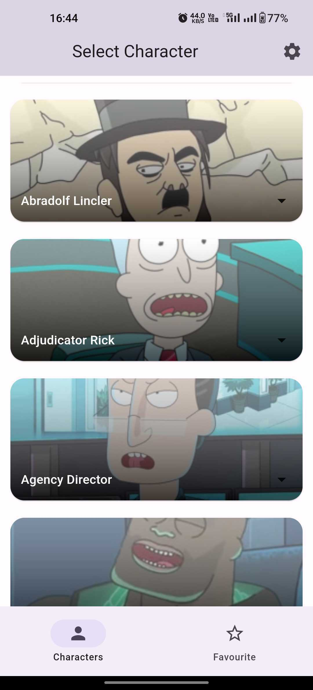
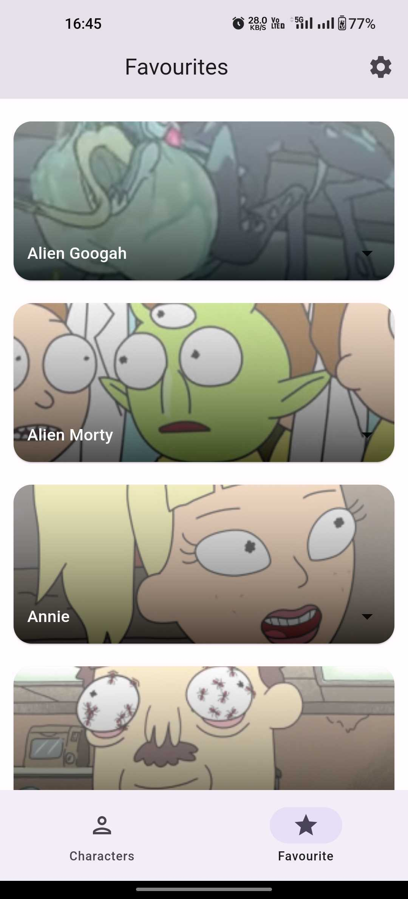
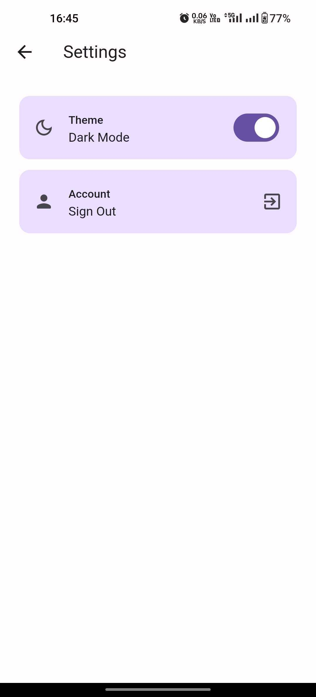

<br/>

## Rick & Morty - Flutter

   A Flutter clean-architecture project that uses Riverpod and Retrofit with best practices. Includes e2e integration tests, widget tests and unit tests. This project usage [rick morty](https://rickandmortyapi.com/documentation/#get-all-characters) opensource api.


  <p align="left">
      <a href = "https://github.com/Solido/awesome-flutter">
        
      </a>
      <a href = "https://github.com/pranay-mm/rick_morty_flutter/stargazers">
        
      </a>
      <a href = "https://github.com/pranay-mm/rick_morty_flutter/network/members">
          
      </a>
      <a href = "https://github.com/pranay-mm/rick_morty_flutter/watchers">
          
      </a>
      <a href = "https://github.com/pranay-mm/rick_morty_flutter/issues">
          
      </a>
  </p>

### 👨‍💻 Tech stack

| Tools               | Link                                                            |
|:--------------------|:----------------------------------------------------------------|
| 🤖 State Management | [flutter_riverpod](https://pub.dev/packages/flutter_riverpod)           |
| 💚 Service Locator  | [get_it](https://pub.dev/packages/get_it)                       |
| 🏛 Navigation       | [Flutter Navigator](https://docs.flutter.dev/ui/navigation)                 |
| 📄 Serialization    | [json_serializable](https://pub.dev/packages/json_serializable) |
| 🚀 Riverpod Test        | [riverpod_test](https://pub.dev/packages/riverpod_test)                 |
| 🖊️ Mock            | [mockito](https://pub.dev/packages/mockito)                     |
| 🌐 Networking            | [Retrofit(Dio)](https://pub.dev/packages/retrofit)                     |
| 💾 Database            | [Floor](https://pub.dev/packages/floor)                     |
| 🔡 Localization            | [intl](https://pub.dev/packages/intl)                     |

### ⚒️ Architecture

The Rick & Morty Flutter app adheres to Clean Architecture principles.
The project architecture has been inspired
from [Praxis Flutter](https://github.com/mutualmobile/PraxisFlutter).

## Supported Platforms

| Android | iOS | macOS | Windows | Linux | Web |
|---------|-----|-------|---------|-------|-----|
| ✅       | ✅   | 🚧     | 🚧       | 🚧     | ❌   |


### 🖥️ Screens

<table style="width:100%">
  <tr>
    <th>OnBoarding</th>
    <th>Login</th> 
    <th>Characters list</th>
  </tr>
  <tr>
    <td></td> 
    <td></td>
    <td></td>
  </tr>
</table>
<table style="width:100%">
  <tr>
    <th>Characters Info</th> 
    <th>Favourites list</th>
    <th>Settings</th>
  </tr>
  <tr>
    <td></td> 
    <td></td>
    <td></td>
  </tr>
</table>

### How to run the project? ✅

To generate code for freez, json serialization and mockito

```
flutter packages pub run build_runner build --delete-conflicting-outputs
```

### How to run tests? ✅

Integration tests

```
flutter test integration_tests/ui_tests.dart
```

Unit tests

```
flutter test 
```

### Find this project useful ? ❤️

- Support it by clicking the ⭐️ button on the upper right of this page. ✌️

### Contribution 🙌

Fork repo and Open new PR. You are most welcome to contribute to this project!

### License

```
MIT License

Copyright (c) 2023 Pranay Patel

Permission is hereby granted, free of charge, to any person obtaining a 
copy of this software and associated documentation files (the "Software"), 
to deal in the Software without restriction, including without limitation 
the rights to use, copy, modify, merge, publish, distribute, sublicense, 
and/or sell copies of the Software, and to permit persons to whom the 
Software is furnished to do so, subject to the following conditions:

The above copyright notice and this permission notice shall be included 
in all copies or substantial portions of the Software.

THE SOFTWARE IS PROVIDED "AS IS", WITHOUT WARRANTY OF ANY KIND, EXPRESS OR 
IMPLIED, INCLUDING BUT NOT LIMITED TO THE WARRANTIES OF MERCHANTABILITY, 
FITNESS FOR A PARTICULAR PURPOSE AND NONINFRINGEMENT. IN NO EVENT SHALL THE 
AUTHORS OR COPYRIGHT HOLDERS BE LIABLE FOR ANY CLAIM, DAMAGES OR OTHER LIABILITY, 
WHETHER IN AN ACTION OF CONTRACT, TORT OR OTHERWISE, ARISING FROM, OUT OF OR IN 
CONNECTION WITH THE SOFTWARE OR THE USE OR OTHER DEALINGS IN THE SOFTWARE.
```